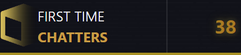

# First Time Chatter

JavaScript WebSocket Application for Tracking Twitch Chat Activity

## Description

Monitor and Record the Number of New Users Participating in Conversations Over a Specified Time Period, with an Emphasis on Casual Use.

This tool initiates recording during OBS sessions and can be easily reloaded as needed.

Similar to a chat overlay, it can be implemented as a browser source and configured using customizable arguments.

## Arguments

**Example 1**: To set the interval to 1800 seconds you can use the following URL:
`?interval=1800`

**Example 2**: If you only want to change the channel to "anotherchannel" and keep the default interval, use this URL:
`?channel=anotherchannel`

**Example 3**: To customize both the interval and channel, you can combine both arguments in the URL:
`?interval=1200&channel=customchannel`

| URL Argument | Default Value | Description                                                                                        |
| ------------ | ------------- | -------------------------------------------------------------------------------------------------- |
| interval     | 3600          | Specifies the time interval (in seconds) over which new users are tracked.                         |
| channel      | "kaicenat"    | Sets the Twitch channel to monitor. If no specific channel is provided, it defaults to "kaicenat". |
